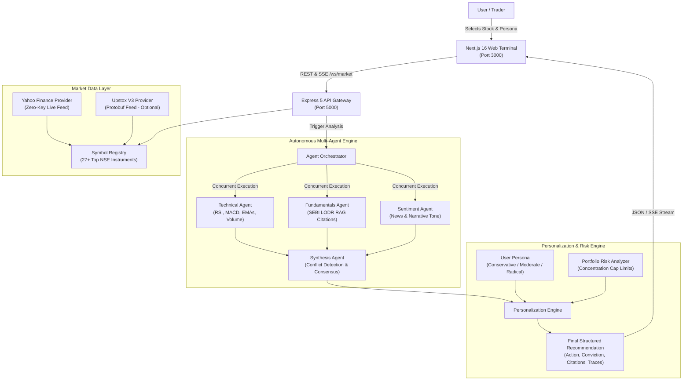
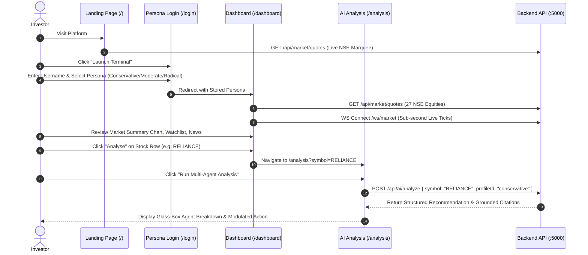
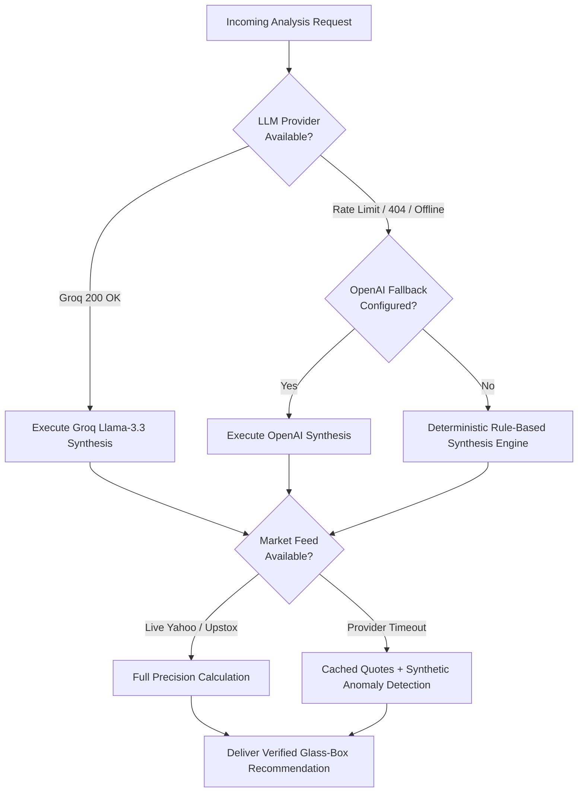

# FinsightAI

> Autonomous Multi-Agent Financial Intelligence Platform for Indian Equities

FinsightAI is an autonomous financial intelligence platform tailored for Indian capital markets. It bridges real-time National Stock Exchange (NSE) market data with parallel, specialized AI agents across fundamentals, technical indicators, and market sentiment. By decoupling market analysis from investor personalization, FinsightAI delivers context-aware, audit-grounded recommendations calibrated to individual risk profiles.

---

## Architecture Overview



---

## Core Value Proposition

Traditional investment platforms broadcast identical buy and sell signals to every user regardless of risk capacity. FinsightAI decouples the objective **market consensus** from the **personalized directive**:

$$\text{Identical Market Data} + \text{Divergent Investor Context} = \text{Differentiated Action}$$

### Decision Comparison Matrix

| Attribute | Conservative Persona | Moderate Persona | Radical / Aggressive Persona |
| :--- | :--- | :--- | :--- |
| **Primary Objective** | Capital preservation & margin of safety | Balanced growth & wealth accumulation | High growth & momentum alpha |
| **Max Single-Stock Cap** | 10% of portfolio | 15% of portfolio | 25% of portfolio |
| **Investment Horizon** | Long Term (3+ Years) | Medium Term (1-3 Years) | Short to Medium (<1 Year) |
| **Market Consensus: Bullish** | Accumulate or Hold (limits drawdown) | Buy / Accumulate | Aggressive Buy |
| **Rich Valuation Scenario** | Throttles to Hold with safety warning | Accumulate in tranches | Proceeds if momentum aligns |
| **Signal Conflict Scenario** | Severe confidence dampening; Avoid | Reduces position sizing | Focuses on volume & catalyst breakout |

---

## Core Capabilities

### 1. Autonomous Multi-Agent Analysis
- **Technical Agent**: Computes 14-period RSI, MACD signal line crossovers, EMA alignment (20/50/200), and 20-day volume surge anomaly ratios.
- **Fundamentals Agent**: Queries an in-memory vector database indexed with authentic SEBI LODR disclosures, corporate filings, and quarterly earnings transcripts to produce factual claims with verbatim citations.
- **Sentiment Agent**: Analyzes news narratives, conference call transcripts, and corporate disclosures to derive qualitative market tone and catalyst impact.
- **Parallel Orchestration**: Runs analytical agents concurrently using `Promise.allSettled()`, bounding latency to the slowest agent rather than their cumulative sum.

### 2. Conflict Detection & Synthesis
When agents disagree (e.g., technical breakout with rich valuation or negative news sentiment), the synthesis engine deterministically classifies conflict severity:
- **None**: Unanimous alignment across dimensions.
- **Mild**: Neutral stance on one dimension with bullish/bearish alignment on others.
- **Sharp**: Direct divergence (e.g., Bullish Technicals vs. Bearish Fundamentals). Triggers automatic confidence dampening and conservative action overrides.

### 3. Glass-Box Observability
- **Verbatim Citations**: Every fundamental assertion links directly to source document excerpts, filing dates, and relevance scores.
- **Trace Emitter**: Emits step-by-step lifecycle events over Server-Sent Events (SSE).
- **Latency & Metadata Telemetry**: Tracks per-agent latency, LLM model versions, and token usage.

### 4. Zero-Key Live NSE Market Engine
- Ships with an out-of-the-box Yahoo Finance market provider requiring zero API keys or broker accounts.
- Pre-configured for 27 top Indian equities and benchmark indices (`RELIANCE`, `TCS`, `HDFCBANK`, `INFY`, `NIFTY50`, `BANKNIFTY`, etc.).
- Dynamically resolves and streams real-time quotes on demand for any valid ticker.
- WebSocket broadcaster (`ws://localhost:5000/ws/market`) provides live sub-second price pushes to connected clients.

---

## Technology Stack

### Frontend
- **Framework**: Next.js 16 (App Router)
- **Library**: React 19
- **Language**: TypeScript
- **Styling**: Tailwind CSS v4
- **Icons**: Lucide React
- **Animation & Visuals**: Framer Motion, Three.js

### Backend
- **Runtime**: Node.js (v18+)
- **Framework**: Express 5
- **Language**: TypeScript (`ts-node`)
- **Real-Time Feeds**: WebSocket (`ws`) & Server-Sent Events (SSE)
- **HTTP Client**: Axios

### AI & Data Engine
- **Primary LLM**: Groq Cloud (`llama-3.3-70b-versatile`, `llama-3.1-8b-instant`, `openai/gpt-oss-120b`)
- **Fallback LLM**: OpenAI API (`gpt-4o-mini`, `gpt-3.5-turbo`)
- **Market Providers**: Zero-Key Yahoo Finance Engine (default) with optional Upstox V3 Protobuf provider
- **Information Retrieval**: In-memory vector store with cosine similarity scoring for SEBI regulatory documents

---

## Repository Structure

```text
FinsightAI/
├── backend/
│   ├── src/
│   │   ├── server.ts                  # Application entrypoint & HTTP server
│   │   ├── app.ts                     # Express app configuration & middleware
│   │   ├── market/
│   │   │   ├── market.service.ts      # Watchlist management & tick aggregation
│   │   │   ├── market.controller.ts   # REST endpoints for quotes & technicals
│   │   │   ├── market.routes.ts       # Express route definitions
│   │   │   ├── market.data.ts         # In-memory equity metadata & filings
│   │   │   ├── symbol-registry.ts     # 27+ NSE instrument definitions
│   │   │   ├── upstox.ts              # Upstox client instantiation & fallback
│   │   │   ├── types.ts               # Market quotes, OHLC, and depth types
│   │   │   ├── broadcaster/           # WebSocket tick broadcast engine
│   │   │   └── providers/
│   │   │       ├── yahoo-finance.provider.ts # Zero-key live NSE data engine
│   │   │       ├── upstox-market.provider.ts # Upstox API provider
│   │   │       └── mock-market.provider.ts   # Resilient fallback provider
│   │   └── ai/
│   │       ├── ai.service.ts          # AI orchestration & recommendation cache
│   │       ├── ai.controller.ts       # Analysis REST & SSE endpoints
│   │       ├── ai.routes.ts           # AI route definitions
│   │       ├── agents/                # Technical, Fundamentals, Sentiment agents
│   │       ├── orchestration/         # Parallel runner & trace emitter
│   │       ├── synthesis/             # Consensus scoring & conflict detector
│   │       ├── rag/                   # Vector store & SEBI filings retrieval
│   │       ├── personalization/       # Profile modulation & portfolio risk
│   │       ├── recommendation/        # Recommendation engine & action assembler
│   │       └── llm/                   # Groq & OpenAI client with robust parsing
│   ├── package.json
│   └── tsconfig.json
│
├── frontend/
│   ├── src/
│   │   ├── app/
│   │   │   ├── layout.tsx             # Root layout with UserProvider & fonts
│   │   │   ├── page.tsx               # Landing page with live NSE pulse
│   │   │   ├── login/
│   │   │   │   └── page.tsx           # Passwordless login & persona setup
│   │   │   ├── dashboard/
│   │   │   │   └── page.tsx           # Stock Market App (Figma design template)
│   │   │   └── analysis/
│   │   │       └── page.tsx           # Dedicated on-demand AI Agent page
│   │   ├── components/
│   │   │   ├── navigation/            # Main navigation & symbol search modal
│   │   │   ├── dashboard/             # Market summary chart, top stocks, news
│   │   │   ├── analysis/              # Agent cards & gauge components
│   │   │   └── watchlist/             # Watchlist table & cards
│   │   ├── context/
│   │   │   └── user-context.tsx       # User identity & persona state management
│   │   └── services/
│   │       └── api.service.ts         # Typed client for backend REST & WebSocket
│   ├── package.json
│   └── tsconfig.json
│
└── docs/                             # Architecture specifications & API tests
```

---

## Application Flow & User Experience



---

## Quick Start Guide

### Prerequisites
- **Node.js**: Version 18.x or higher
- **Package Manager**: npm or yarn
- **API Keys (Optional)**: Groq API Key (recommended for live LLM inference). If absent, the system uses resilient deterministic fallback models.

### 1. Clone the Repository
```bash
git clone https://github.com/HariAswath/FinsightAI.git
cd FinsightAI
```

### 2. Configure Backend
Navigate to the `backend` directory and create an `.env` file:
```bash
cd backend
npm install
```

Create `backend/.env`:
```env
PORT=5000
GROQ_API_KEY=your_groq_api_key_here
# Optional fallbacks:
OPENAI_API_KEY=your_openai_key_here
UPSTOX_ACCESS_TOKEN=your_upstox_token_here
```

Start the backend development server:
```bash
npm run dev
```

The backend starts with the Zero-Key Yahoo Finance provider active:
- REST API: `http://localhost:5000`
- Market Stream: `ws://localhost:5000/ws/market`
- Health Check: `http://localhost:5000/health`

### 3. Configure Frontend
Open a new terminal, navigate to the `frontend` directory, and install dependencies:
```bash
cd frontend
npm install
```

Create `frontend/.env.local` (optional, defaults to `http://localhost:5000`):
```env
NEXT_PUBLIC_API_URL=http://localhost:5000
NEXT_PUBLIC_WS_URL=ws://localhost:5000/ws/market
```

Start the frontend development server:
```bash
npm run dev
```

Open `http://localhost:3000` in your browser.

---

## API Reference

### Market Data Endpoints

| Method | Endpoint | Description |
| :--- | :--- | :--- |
| `GET` | `/health` | Server health check and timestamp |
| `GET` | `/api/market/quotes` | Retrieve live quotes for all 27 registered NSE instruments |
| `GET` | `/api/market/:symbol` | Fetch live quote, technical metrics, and SEBI filings for a ticker |
| `GET` | `/api/market/:symbol/technical` | Fetch technical indicators (RSI-14, MACD, EMAs, Bollinger Bands) |
| `GET` | `/api/market/:symbol/filings` | Retrieve indexed SEBI regulatory disclosures and excerpts |
| `WS` | `/ws/market` | WebSocket stream broadcasting tick-by-tick market price updates |

### AI Intelligence Endpoints

| Method | Endpoint | Description |
| :--- | :--- | :--- |
| `GET` | `/api/ai/status` | Check AI engine status, active LLM provider, and registered agents |
| `GET` | `/api/ai/profiles` | List preset risk profiles (Conservative, Moderate, Aggressive) |
| `GET` | `/api/ai/portfolio/sample` | Retrieve sample portfolio holdings and concentration weights |
| `POST` | `/api/ai/analyze` | Run on-demand multi-agent analysis (`{ symbol, profileId }`) |
| `POST` | `/api/ai/compare-profiles` | Compare recommendation modulation across all 3 risk personas |
| `GET` | `/api/ai/analyze/stream` | Stream real-time agent execution events using Server-Sent Events |

### Example Analysis Payload

```bash
curl -X POST http://localhost:5000/api/ai/analyze \
  -H "Content-Type: application/json" \
  -d '{"symbol": "RELIANCE", "profileId": "conservative"}'
```

---

## Fault Tolerance & Graceful Degradation

FinsightAI is engineered to maintain high availability under external service disruptions.



1. **LLM Resilience**: When Groq rate limits or fails, the engine falls back to secondary models, OpenAI, or the built-in deterministic rule engine. The user receives a valid recommendation with full transparency.
2. **Market Feed Resilience**: If upstream market connections degrade, the engine serves cached tick values and flags data completeness in the response payload.
3. **Response Caching**: A 30-second TTL cache in `AIService` prevents duplicate requests from exhausting API quotas.

---

## Testing & Verification

### Backend Integration Tests
Execute the end-to-end integration test suite to verify market providers, LLM clients, and agent orchestration:
```bash
cd backend
npm run test:ai
```

### Frontend Production Build
Validate static type safety and compilation across all Next.js App Router pages:
```bash
cd frontend
npm run build
```

---

## License

This project is licensed under the [ISC License](LICENSE). See the [LICENSE](LICENSE) file for details.
